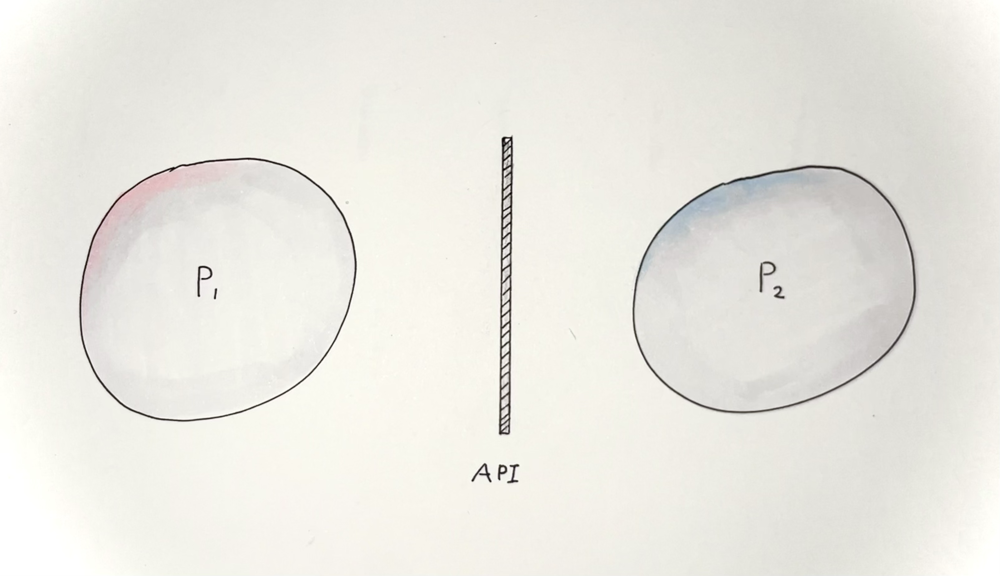
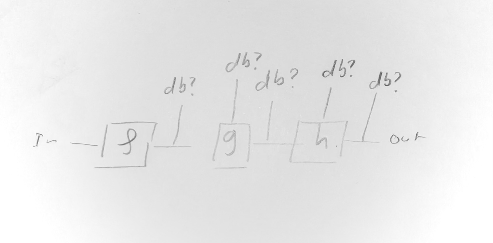

# Introduction

- [ ] Add a header for each page

Programming interface are large, nebulous concepts that permeate all layers for
computer software. They often do not have a single specific and unique object
that represents them, and instead, purely emerge from the implementation of the
program.

For example, a command-line interface is summoned into existence by its
implementation. There is rarely an object called "the CLI" that one can manipulate as
a first-class object. That is, we cannot take "the CLI" as an argument to a function
and return another "CLI" as an output. There is data that _represents_ the CLI, like
man-pages, help commands, or even maybe a piece of syntax from a domain-specific
language that describes it.

{ width=300 height=220 }

A program's command-line interface is an example of the boundary between a
program's internal behaviour and the outside world interacting with it. It
regiments in what way the outside world is allowed to interact with the program,
and what can an outsider expect in return from any one interaction.

{ width=300 height=220 }

If one were to draw an analogy, a command-line interface acts like the membrane
of a cell, separating the outside elements from the inside, only
allowing a very specific set of messages(proteins) to permeate, and influence the
behavior of the program(cell). This behaviour could be an output value, or
merely a side-effect that will influence the rest of the world. Crucially, an
outsider does not know what further steps are taken after sending a message, the interface ensures the program is a black box. 

Interfaces between programs advertise an, often deceptive, input-output relation between the messages sent by the user and the responses received.
In reality, multiple layers of interaction are involved, a command line interface
might make syscalls, perform network requests, or call other command-line
programs to produce a result. Knowing this, we want to identify the
compositional nature of APIs along with the fact that they provide a simple
high-level description of interaction hiding the details that are not relevant
to an outsider.

{ width=300 height=220 }

Viewing this program as a linear sequence of steps help understand what stages are
involved, but it does not help understand the program in terms of
API-transformation. We can in fact take an existing program and understand it as an API by _folding_ the execution stages of the program and match
inputs with outputs. 

{ width=300 height=220 }

The value of this approach is made evident when we want to update this program
and for example delegate some work to a database. one of the questions to ask
is "at what point should we convert our data into data base queries" one might
be tempted to translate directly from messages to SQL queries, or maybe to keep
the action around and translate its input into database queries and run it. All
those solutions are valid but understanding exactly what trade-off they offer is
difficult to evaluate. If the question is framed in terms of API evaluating each
solution becomes much clearer.

{ width=300 height=220 }

{ width=300 height=220 }

Indeed, a program exposing an API can be seen as an "API transformer" that will convert from a high-level API exposed to the user, to a lower-level API to interact with a machine's subsystem. In the illustration above, our program `P` delegates its work to a subsystem `g`. In that context, adding support for a database connection amounts to making a choice of where to delegate the information, are we connecting to `g`, or are we connecting to the DB? Once the choice is made, the program interacts with the API of `g` or the API of the database (typically SQL queries for an SQL database).

## Challenges in Programming

Programming, in its most naive interpretation, is about communicating human
intent to a computer, in a way that other humans can understand, and in a way
that a computer can translate into basic instructions to run on a CPU.

This thesis is about the data that sits at the boundary between programs, and
how to manipulate those boundaries to write programs.

This activity is guided by the programming language the user is employing, and
the domain for which the program is written, for example low-level driver programming,
server applications, or video games. Typically, writing in Assembly gives
access to the notion of register, memory, bit vector, pointer, interrupts,
syscalls, etc. But a program written in Java gives notions of Object, inheritance
and class. Each of those notions enable different goal to be reached more or less
easily.

The domain a language targets is both a blessing and a curse.
It makes writing programs in the intended domain intuitive and easy. But reading
a program written outside its intended domain creates unease and confusion.
Because of this, nowadays, we have very many programming languages to chose from,
and they all have their own goals as to what programming should look like and what
it is for. A language like Java eases the writing of programs using objects and
interfaces. A language like Haskell eases the writing of programs using
higher-order functions and typeclasses. A language like Idris eases the writing
of programs using first-order types and proofs. It is this last programming
language that I will be using in this thesis, to study this notion of "boundary"
between programs.

Programming Language design has never before been more exciting. The Programming
Language community is building languages that solve problems that were with us
since the dawn of programming and they keep improving.
Topics such as memory ownership, effect, or grading are actively being research
and the outcome of this work can be seen in

Rust for example, takes seriously the notion of ownership and
enable generating very efficient _and_ safe code by ensuring that data is not
arbitrarily aliased. Coupled with modern programming patterns such as traits,
higher-order functions, and algebraic data types, Rust offers a complete package for
modern systems-programming. Its large community ensures packages are maintained, bugs
are fixed, and support for editors is good.

Other programming contexts require to express \emph{what} a program does rather than \emph{how} it will
perform a task using pointers and bytes. In this context, languages like Unison, or Koka
provide the user with \emph{effect handlers}. Effects handlers enable the programmer to
select, restrict, or combine what effects a program is allowed to perform.
Writing programs always involve some notion of effect, for example writing a string to
a command line buffer, or reading some bytes from the network.
Typically, programming languages
will put no restriction on the effects that one can perform. But Unison and Koka make
it possible to seamlessly combine multiple programs which effects are resctrited because
their effects they are expected to perform are explicitly marked. This can be used in
any sorts of way like only allowing some folders to be read or written. Only allowing
some parts of the program to access some secure enclave, or only
access the network in some environment.


## The Idris Programming Language

We cannot differenciate programming languages by their ability to be turing complete,
that is, to run programs. Nowadays, avoiding turing-completeness is harder than
achieving it (cite MTG is turing complete, crabs are turing complete, minecraft
redstone, etc.). Instead, we judge programming language by how well they express
solving some specific problems. In general, this notion of fitness is defined by
culture, an intangible aspect that is difficult for me to measure with any certainty, and
therefore will not make any claims about. However, I will speculate that the
initial goals set by the programming language author(s), the community fostered,
and the public communication produced by the prominent members of this community,
all play a role in shaping the position of the programming language in the overall
social landscape of programming. The outcome of this culture can be more concretely
seen in the type of libraries developped, the benchmarking strengths of the language,
and the expressivity afforded for certain problem domains.


While the notion of fitness for programming language is subjective and cultural,
some aspects are fundamental and objective. For example, to formalise proofs, one
requires a _proof assistant_ that implement a logical system in which the user
will want to write proofs. Without it, writing proofs is plaingly impossible, as
the logical system dictates what proofs can be written in the first place.

The Idris programming language has been chosen after evaluating those two criteria.
It is a programming featuring first-class types, or _dependent types_,  which
give the programmer a way to treat types as values. This ability to manipulate types
creates two different avenues for expressivity. First, it allows to remove the
need for meta-programming to implement common programming features.

For example, in Rust, printing a formatted string makes use of the `print!` macro that
will expand into code that will be typechecked.

```Rust
print!("hello {} !", "world");
```
```C
printf("hello %s !", "world");
```

On the other hand, C will not make any check and will crash at runtime if the format
is incorrectly used. Neither those options are ideal, what we would like is for
print to behave like any other function, and to also be typechecked. The subtlety
being that the type of `print` _depends_ on the argument string given in first position.

A string `"hello"` will not allow any subsequent argument, but the string `"amount %d"`
will require the user to provide an integer as argument. That is an example of
a dependent type, and that is what Idris can do.

```idris
-- example taken from https://www.stranger.systems/posts/by-slug/type-safe-variadic-printf.html

-- a safe printf function in idris
printf : (fmt : String) -> PrintfType (parseFormat (unpack fmt))

>:t printf "%s %s%s %3d %d"
String -> String -> String -> Int -> Int -> String

> printf "%s %s%s %3d %d" "Hello" "world" "!" 1 23
"Hello world! 001 23"

>:t printf "%s %d"
String -> Int -> String
```

That's the first expressive benefit of dependent types, to write complex
relations between values and types _within the language_ without resorting to
features like compiler built-ins or meta-programming. Essentially turning what would
otherwise be complex programming language features into customisable libraries.

The second expressive benefit of dependent types is that, by virtue of
implementing Martin lof type theory, they are a perfectly viable theorem prover.
Allowing the user to write proofs in the language of constructive logic. Of
course, there is no one singular implementation of constructive logic and
choices made when writing the compiler greatly affect the kind of proofs that
are possible to write.

Finally, a particularity of Idris is its community and the effort it spends
in creating a programming environement that's amenable to software engineering.
In what is colloquially called "the ecosystem" we find libraries to parse many
types of file formats (such as JSON, TOML, Dhall, Markdown), instanciate
servers (idris2-http, tyttp, pact-server), write web frontend code (idris2-dom,
pact-client, rhone, idris2-css), and even run sqlite databases. Those
libraries are rendered accessible by a community-supported _package manager_
that helps managing dependencies, keep track of version compatibility, and
distribute software at scale.
This large collection of libraries makes Idris very well suited in tackling the challenges
posed by contemporary software engineering in particular server development,
for whick I am primarily interested in.

Because of those three aspects, expressivity afforded by dependent types,
theorem proving, and community support, I have chosen Idris as the programming
language to develop the ideas presented in this Thesis.
